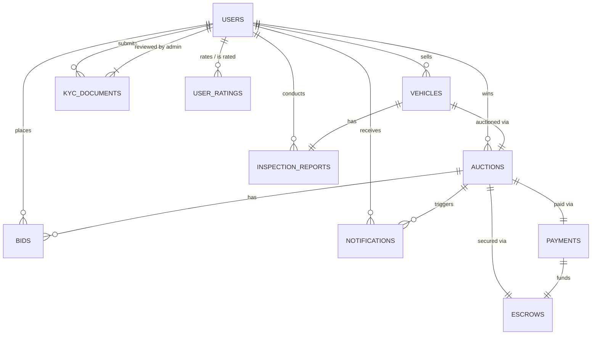

# Autousata Database Documentation

This document provides a comprehensive reference for the Autousata Oracle Database schema. It is intended for developers and AI agents building APIs and services on top of this data model.

## Schema Overview

The database is designed for a used car auction platform. It handles users (buyers, sellers, inspectors, admins), vehicle listings, inspections, auctions, bidding, payments, escrow, and notifications.

**Schema Name:** `DIP`
**Database Type:** Oracle Database 19c+

## Entity Relationship Diagram (Mermaid)

## Tables Reference

### 1. USERS
Core entity for all platform participants.

| Column | Type | Constraints | Description |
| :--- | :--- | :--- | :--- |
| `ID` | VARCHAR2(101) | PK | Unique User ID (String/GUID) |
| `EMAIL` | VARCHAR2(100) | Unique, Not Null | User email address |
| `PHONE` | VARCHAR2(100) | Unique, Not Null | User phone number |
| `FIRST_NAME` | VARCHAR2(100) | Not Null | |
| `LAST_NAME` | VARCHAR2(100) | Not Null | |
| `PASSWORD_HASH` | VARCHAR2(101) | Not Null | Hashed password |
| `PHONE_VERIFIED` | CHAR(1) | Default '0', Check | '1' or '0' |
| `EMAIL_VERIFIED` | CHAR(1) | Default '0' | '1' or '0' |
| `IS_ACTIVE` | CHAR(1) | Default '1' | '1' (True) or '0' (False) |
| `IS_BANNED` | CHAR(1) | Default '0' | '1' (True) or '0' (False) |
| `BAN_REASON` | VARCHAR2(100) | | Optional ban reason |
| `PROFILE_PIC_URL` | VARCHAR2(1000) | | Profile image URL |
| `BIO` | VARCHAR2(100) | | Short bio |
| `LOCATION__CITY` | VARCHAR2(100) | | Legacy/duplicate city column (double underscore) |
| `CREATED_AT` | TIMESTAMP WITH LOCAL TIME ZONE | Default CURRENT_TIMESTAMP | Creation timestamp |
| `UPDATED_AT` | TIMESTAMP WITH LOCAL TIME ZONE | Default CURRENT_TIMESTAMP | Update timestamp |
| `DELETED_AT` | TIMESTAMP WITH LOCAL TIME ZONE | Default CURRENT_TIMESTAMP | Soft delete timestamp |
| `KYC_STATUS` | VARCHAR2(20) | Default 'pending' | Status of identity verification |
| `ROLE` | VARCHAR2(20) | Check | `client`, `admin`, `inspector` |
| `LOCATION_CITY` | VARCHAR2(100) | | Primary location city |
| `EMAIL_VERIFICATION_TOKEN` | VARCHAR2(100) | | Verification token |
| `EMAIL_TOKEN_EXPIRY` | TIMESTAMP | | Verification expiry |

### 2. KYC_DOCUMENTS
Identity verification documents for sellers.

| Column | Type | Constraints | Description |
| :--- | :--- | :--- | :--- |
| `ID` | VARCHAR2(36) | PK | UUID |
| `USER_ID` | VARCHAR2(36) | FK -> USERS | The user submitting documents |
| `DOCUMENT_TYPE` | VARCHAR2(20) | Check | `national_id`, `passport`, `driver_license` |
| `DOCUMENT_NUMBER` | VARCHAR2(50) | Not Null | Document number/identifier |
| `FULL_NAME_ON_DOC` | VARCHAR2(200) | Not Null | Full name on document |
| `DATE_OF_BIRTH` | DATE | Not Null | DOB on document |
| `ISSUE_DATE` | DATE | Not Null | Document issue date |
| `EXPIRY_DATE` | DATE | Check (expiry > issue) | Document expiry date |
| `DOCUMENT_FRONT_URL` | VARCHAR2(500) | Not Null | URL to image |
| `DOCUMENT_BACK_URL` | VARCHAR2(500) | | URL to image |
| `SELFIE_WITH_DOC_URL`| VARCHAR2(500) | Not Null | URL to image |
| `STATUS` | VARCHAR2(20) | Check | `pending`, `approved`, `rejected` |
| `REJECTION_REASON` | VARCHAR2(1000) | | Optional rejection reason |
| `VERIFICATION_METHOD` | VARCHAR2(20) | Default 'manual', Check | `manual`, `ai_automated` |
| `SUBMITTED_AT` | TIMESTAMP | Default CURRENT_TIMESTAMP | Submitted timestamp |
| `REVIEWED_AT` | TIMESTAMP | | Reviewed timestamp |
| `REVIEWED_BY_ADMIN_ID`| VARCHAR2(36) | FK -> USERS | Admin who reviewed the doc |

### 3. VEHICLES
Cars listed for sale.

| Column | Type | Constraints | Description |
| :--- | :--- | :--- | :--- |
| `ID` | VARCHAR2(36) | PK | UUID |
| `SELLER_ID` | VARCHAR2(36) | FK -> USERS | Owner of the vehicle |
| `MAKE` | VARCHAR2(100) | Not Null | Manufacturer |
| `MODEL` | VARCHAR2(100) | Not Null | Model name |
| `YEAR_MFG` | NUMBER(4) | Not Null | Model year |
| `MILEAGE_KM` | NUMBER(10) | Not Null | Odometer reading in kilometers |
| `VIN` | VARCHAR2(17) | Unique (nullable) | Vehicle Identification Number |
| `PLATE_NUMBER` | VARCHAR2(20) | Unique (nullable) | License plate |
| `COLOR` | VARCHAR2(50) | Not Null | Exterior color |
| `BODY_TYPE` | VARCHAR2(20) | Not Null | `sedan`, `suv`, `truck`, `coupe`, `hatchback`, `van`, `convertible` |
| `TRANSMISSION` | VARCHAR2(20) | Not Null | `manual`, `automatic` |
| `FUEL_TYPE` | VARCHAR2(20) | Not Null | `petrol`, `diesel`, `electric`, `hybrid` |
| `SEATS` | NUMBER(2) | Default 5 | Number of seats |
| `STATUS` | VARCHAR2(20) | Check | `draft`, `active`, `sold`, `delisted` |
| `CAR_CONDITION` | VARCHAR2(20) | Check | `excellent`, `good`, `fair`, `poor` |
| `PRICE_EGP` | NUMBER(15,2) | Not Null | Listed price (or reserve context) |
| `CURRENCY` | VARCHAR2(3) | Default `EGP` | Currency code |
| `DESCRIPTION` | CLOB | Not Null | Listing description |
| `LOCATION_CITY` | VARCHAR2(100) | Not Null | City/location of the vehicle |
| `FEATURES` | CLOB | JSON Check | JSON array of features |
| `INSPECTION_REQ` | NUMBER(1) | Default 1 | Inspection required flag |
| `INSPECTION_REPORT_ID`| VARCHAR2(36) | FK -> INSPECTION_REPORTS | Link to approved inspection |
| `CREATED_AT` | TIMESTAMP | Default CURRENT_TIMESTAMP | Creation timestamp |
| `UPDATED_AT` | TIMESTAMP | Default CURRENT_TIMESTAMP | Update timestamp |
| `PUBLISHED_AT` | TIMESTAMP | | Published timestamp |
| `DELETED_AT` | TIMESTAMP | | Soft delete timestamp |
| `VIEW_COUNT` | NUMBER(10) | Default 0 | View counter |

### 4. INSPECTION_REPORTS
3rd party inspection results.

| Column | Type | Constraints | Description |
| :--- | :--- | :--- | :--- |
| `ID` | VARCHAR2(36) | PK | UUID |
| `VEHICLE_ID` | VARCHAR2(36) | FK -> VEHICLES | Subject vehicle |
| `INSPECTOR_ID` | VARCHAR2(36) | FK -> USERS | Inspector performing the check |
| `INSPECTION_DATE` | DATE | Not Null | Date of inspection |
| `LOCATION_CITY` | VARCHAR2(100) | Not Null | Inspection city |
| `STATUS` | VARCHAR2(20) | Check | `pending`, `passed`, `failed` |
| `ODOMETER_READING` | NUMBER(10) | Not Null | Odometer reading |
| `OVERALL_CONDITION` | VARCHAR2(20) | Check | `excellent`, `good`, `fair`, `poor` |
| `ENGINE_COND` | VARCHAR2(20) | Check | `excellent`, `good`, `fair`, `poor` |
| `TRANSMISSION_COND` | VARCHAR2(20) | Check | `excellent`, `good`, `fair`, `poor` |
| `SUSPENSION_COND` | VARCHAR2(20) | Not Null | Suspension condition |
| `INTERIOR_COND` | VARCHAR2(20) | Not Null | Interior condition |
| `PAINT_COND` | VARCHAR2(20) | Not Null | Paint condition |
| `ACCIDENT_HISTORY` | CLOB | | Accident history notes |
| `MECHANICAL_ISSUES` | CLOB | | Mechanical issues |
| `REQUIRED_REPAIRS` | CLOB | | Required repairs |
| `ESTIMATED_REPAIR_COST` | NUMBER(12,2) | | Estimated repair cost |
| `INSPECTOR_NOTES` | CLOB | | Inspector notes |
| `PHOTOS_URL` | CLOB | JSON Check | JSON array of image URLs |
| `REPORT_DOC_URL` | VARCHAR2(500) | | Link to PDF report |
| `INSPECTED_AT` | TIMESTAMP | Default CURRENT_TIMESTAMP | Inspection timestamp |
| `REPORT_GENERATED_AT` | TIMESTAMP | | Report generation time |

### 5. AUCTIONS
The bidding event for a vehicle.

| Column | Type | Constraints | Description |
| :--- | :--- | :--- | :--- |
| `ID` | VARCHAR2(36) | PK | UUID |
| `VEHICLE_ID` | VARCHAR2(36) | Unique, FK -> VEHICLES | One active auction per vehicle |
| `SELLER_ID` | VARCHAR2(36) | FK -> USERS | |
| `STATUS` | VARCHAR2(20) | Check | `draft`, `scheduled`, `live`, `ended`, `settled`, `cancelled` |
| `START_TIME` | TIMESTAMP | Not Null | |
| `END_TIME` | TIMESTAMP | Not Null | Can be extended |
| `ORIGINAL_END_TIME` | TIMESTAMP | Not Null | Original end time |
| `RESERVE_PRICE_EGP` | NUMBER(15,2) | Not Null | Reserve price |
| `STARTING_BID_EGP` | NUMBER(15,2) | Not Null | Starting bid |
| `CURRENT_BID_EGP` | NUMBER(15,2) | Default 0 | Cached current highest bid |
| `BID_COUNT` | NUMBER(10) | Default 0 | Denormalized bid count |
| `MIN_BID_INCREMENT` | NUMBER(12,2) | Default 50 | Minimum increment |
| `AUTO_EXTEND_ENABLED` | NUMBER(1) | Default 1 | Auto-extend enabled |
| `AUTO_EXTEND_MINUTES` | NUMBER(3) | Default 5 | Auto-extend minutes |
| `MAX_AUTO_EXTENSIONS` | NUMBER(3) | Default 3 | Max extensions |
| `AUTO_EXT_COUNT` | NUMBER(3) | Default 0 | Auto-extend count |
| `LEADING_BIDDER_ID` | VARCHAR2(36) | FK -> USERS | Current highest bidder |
| `WINNER_ID` | VARCHAR2(36) | FK -> USERS | Final winner |
| `PAYMENT_ID` | VARCHAR2(36) | FK -> PAYMENTS | Linked payment |
| `CREATED_AT` | TIMESTAMP | Default CURRENT_TIMESTAMP | Creation timestamp |
| `STARTED_AT` | TIMESTAMP | | Actual start time |
| `ENDED_AT` | TIMESTAMP | | Actual end time |

### 6. BIDS
Individual bids placed on an auction.

| Column | Type | Constraints | Description |
| :--- | :--- | :--- | :--- |
| `ID` | VARCHAR2(36) | PK | UUID |
| `AUCTION_ID` | VARCHAR2(36) | FK -> AUCTIONS | |
| `BIDDER_ID` | VARCHAR2(36) | FK -> USERS | |
| `AMOUNT_EGP` | NUMBER(15,2) | Not Null | Bid amount |
| `PROXY_BID_MAX_EGP` | NUMBER(15,2) | | Max proxy bid |
| `STATUS` | VARCHAR2(20) | Check | `accepted`, `rejected`, `retracted` |
| `BID_SOURCE` | VARCHAR2(20) | Check | `manual`, `auto_proxy`, `auto_extend` |
| `IP_ADDRESS` | VARCHAR2(45) | | Bidder IP |
| `CREATED_AT` | TIMESTAMP | Default CURRENT_TIMESTAMP | Creation timestamp |
| `UPDATED_AT` | TIMESTAMP | Default CURRENT_TIMESTAMP | Update timestamp |

### 7. PAYMENTS
Transaction records.

| Column | Type | Constraints | Description |
| :--- | :--- | :--- | :--- |
| `ID` | VARCHAR2(36) | PK | UUID |
| `AUCTION_ID` | VARCHAR2(36) | FK -> AUCTIONS | |
| `BUYER_ID` | VARCHAR2(36) | FK -> USERS | Payer |
| `SELLER_ID` | VARCHAR2(36) | FK -> USERS | Payee (indirectly) |
| `AMOUNT_EGP` | NUMBER(15,2) | Not Null | Total amount paid |
| `CURRENCY` | VARCHAR2(3) | Default `EGP` | Currency code |
| `PROCESSOR_FEE_EGP` | NUMBER(12,2) | Not Null | Processor fee |
| `PAYMENT_METHOD` | VARCHAR2(20) | Not Null | Payment method |
| `GATEWAY` | VARCHAR2(20) | Not Null | e.g., `Paymob` |
| `GATEWAY_ORDER_ID` | VARCHAR2(255) | Not Null | Gateway order id |
| `GATEWAY_TRANS_ID` | VARCHAR2(255) | | Gateway transaction id |
| `STATUS` | VARCHAR2(20) | Check | `pending`, `processing`, `completed`, `failed`, `refunded` |
| `FAILURE_REASON` | CLOB | | Failure details |
| `INITIATED_AT` | TIMESTAMP | Default CURRENT_TIMESTAMP | Initiated timestamp |
| `COMPLETED_AT` | TIMESTAMP | | Completed timestamp |
| `FAILED_AT` | TIMESTAMP | | Failed timestamp |
| `REFUNDED_AT` | TIMESTAMP | | Refunded timestamp |

### 8. ESCROWS
Funds held securely until transfer is confirmed.

| Column | Type | Constraints | Description |
| :--- | :--- | :--- | :--- |
| `ID` | VARCHAR2(36) | PK | UUID |
| `PAYMENT_ID` | VARCHAR2(36) | Unique, FK -> PAYMENTS | Source of funds |
| `AUCTION_ID` | VARCHAR2(36) | FK -> AUCTIONS | Linked auction |
| `SELLER_ID` | VARCHAR2(36) | FK -> USERS | Seller |
| `BUYER_ID` | VARCHAR2(36) | FK -> USERS | Buyer |
| `TOTAL_AMOUNT_EGP` | NUMBER(15,2) | Not Null | Total held amount |
| `COMMISSION_EGP` | NUMBER(12,2) | Not Null | Platform commission |
| `PROCESSOR_FEE_EGP` | NUMBER(12,2) | Not Null | Processor fee |
| `SELLER_PAYOUT_EGP` | NUMBER(15,2) | Not Null | Seller payout |
| `STATUS` | VARCHAR2(20) | Check | `held`, `released`, `refunded`, `disputed` |
| `HELD_AT` | TIMESTAMP | Default CURRENT_TIMESTAMP | When funds held |
| `SELLER_TRANSFER` | TIMESTAMP | | When seller confirms transfer |
| `BUYER_RECEIVED` | TIMESTAMP | | When buyer confirms receipt |
| `BOTH_PARTIES` | TIMESTAMP | | When both confirmed |
| `RELEASED_AT` | TIMESTAMP | | Release timestamp |
| `DISPUTE_FILED_AT` | TIMESTAMP | | Dispute filed at |
| `DISPUTE_FILED_BY` | VARCHAR2(36) | FK -> USERS | Dispute user |
| `DISPUTE_REASON` | CLOB | | Dispute reason |
| `DISPUTE_RESOLVED_AT` | TIMESTAMP | | Dispute resolved |
| `DISPUTE_NOTES` | CLOB | | Dispute notes |
| `AUTO_RELEASE_AT` | TIMESTAMP | | Auto release time |

### 9. USER_RATINGS
Reputation system.

| Column | Type | Constraints | Description |
| :--- | :--- | :--- | :--- |
| `ID` | VARCHAR2(36) | PK | UUID |
| `AUCTION_ID` | VARCHAR2(36) | FK -> AUCTIONS | Related auction |
| `RATER_ID` | VARCHAR2(36) | FK -> USERS | User who rates |
| `RATED_USER_ID` | VARCHAR2(36) | FK -> USERS | User being rated |
| `RATING_DIRECTION` | VARCHAR2(20) | Check | `buyer_to_seller`, `seller_to_buyer` |
| `RATING_SCORE` | NUMBER(1) | Check 1-5 | Star rating |
| `CATEGORY_SCORES` | CLOB | JSON Check | JSON category scores |
| `POSITIVE_ASPECTS` | CLOB | JSON Check | JSON positive aspects |
| `NEGATIVE_ASPECTS` | CLOB | JSON Check | JSON negative aspects |
| `COMMENT_TEXT` | CLOB | | Free text comment |
| `STATUS` | VARCHAR2(20) | Check | `published`, `hidden`, `disputed` |
| `IS_PURCHASE_VERIFIED` | NUMBER(1) | Default 1 | Verified purchase flag |
| `HELPFUL_COUNT` | NUMBER(10) | Default 0 | Helpful votes |
| `DISPUTED_AT` | TIMESTAMP | | Disputed timestamp |
| `DISPUTE_REASON` | CLOB | | Dispute reason |
| `CREATED_AT` | TIMESTAMP | Default CURRENT_TIMESTAMP | Created timestamp |
| `UPDATED_AT` | TIMESTAMP | Default CURRENT_TIMESTAMP | Updated timestamp |

### 10. NOTIFICATIONS
System alerts.

| Column | Type | Constraints | Description |
| :--- | :--- | :--- | :--- |
| `ID` | VARCHAR2(36) | PK | UUID |
| `NOTIFICATION_TYPE` | VARCHAR2(50) | Check | `account_alert`, `auction_outbid`, `auction_won`, `auction_ended`, `payment_received`, `payment_failed`, `inspection_complete` |
| `TITLE` | VARCHAR2(255) | Not Null | Notification title |
| `BODY` | CLOB | Not Null | Notification body |
| `ACTION_URL` | VARCHAR2(500) | | Optional action URL |
| `RELATED_AUCTION_ID` | VARCHAR2(36) | FK -> AUCTIONS | Related auction |
| `RELATED_PAYMENT_ID` | VARCHAR2(36) | FK -> PAYMENTS | Related payment |
| `CHANNELS_SENT` | CLOB | JSON Check | e.g. `["email", "push"]` |
| `EMAIL_SENT_AT` | TIMESTAMP | | Email sent at |
| `SMS_SENT_AT` | TIMESTAMP | | SMS sent at |
| `PUSH_SENT_AT` | TIMESTAMP | | Push sent at |
| `IS_READ` | NUMBER(1) | Check | 0 or 1 |
| `READ_AT` | TIMESTAMP | | Read timestamp |
| `IS_ARCHIVED` | NUMBER(1) | Check | 0 or 1 |
| `SCHEDULED_FOR` | TIMESTAMP | | Scheduled delivery |
| `SENT_AT` | TIMESTAMP | | Sent timestamp |
| `CREATED_AT` | TIMESTAMP | Default CURRENT_TIMESTAMP | Created timestamp |

## Stored Procedures

### `sp_register_user`
Creates a new user. Handles ID generation and default values.
*   **Inputs**: `first_name`, `last_name`, `email`, `phone`, `password` (hash), `profile_img`
*   **Outputs**: `out_id` (New User ID), `out_status` ('SUCCESS', 'EMAIL_EXISTS', 'DB_ERROR...')

### `sp_login_user`
Validates user credentials (logic only, password check must be done by app comparing hash).
*   **Inputs**: `p_email`
*   **Outputs**: User details (`id`, `password_hash`, `first_name`, `last_name`, `role`, `profile_img`) and `o_status` ('FOUND', 'BANNED', 'INACTIVE', 'USER_NOT_FOUND').

### `sp_get_user_by_id`
Fetches basic public user info.
*   **Inputs**: `p_user_id`
*   **Outputs**: `o_name`, `o_email`, `o_role`, `o_status`

## API Implementation Notes

1.  **JSON Handling**:
    *   Columns like `VEHICLES.FEATURES`, `INSPECTION_REPORTS.PHOTOS_URL`, `NOTIFICATIONS.CHANNELS_SENT`, `USER_RATINGS.CATEGORY_SCORES`, `USER_RATINGS.POSITIVE_ASPECTS`, `USER_RATINGS.NEGATIVE_ASPECTS` are stored as **CLOB** with `IS JSON` constraints.
    *   Ensure your API backend parses these JSON strings when reading and stringifies them when writing.

2.  **Date/Time**:
    *   Timestamps use `TIMESTAMP(6)` (and some `TIMESTAMP WITH LOCAL TIME ZONE` in `USERS`).
    *   Use ISO 8601 strings in your API (e.g., `2023-10-27T10:00:00Z`).

3.  **Status Workflows**:
    *   **Auction Lifecycle**: `draft` -> `scheduled` -> `live` -> `ended` -> `settled`.
    *   **Escrow Lifecycle**: `held` -> (Buyer & Seller Confirm) -> `released`.
    *   **KYC Status**: `pending` -> `approved` / `rejected`.
    *   **Payment Status**: `pending` -> `processing` -> `completed` (or `failed`/`refunded`).

4.  **Concurrency**:
    *   The `AUCTIONS.CURRENT_BID_EGP` and `BID_COUNT` are denormalized fields. When placing a bid, ensure you use transactions to update the `BIDS` table and the `AUCTIONS` table atomically to prevent race conditions.

5.  **Security**:
    *   Always hash passwords before calling `sp_register_user` or comparing with `sp_login_user`.
    *   Use `sp_login_user` to check for `BANNED` or `INACTIVE` status during authentication.
