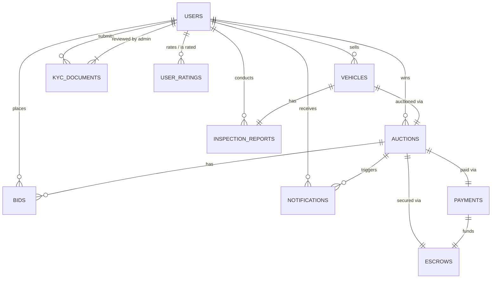

# Autousata Database Documentation

This document provides a comprehensive reference for the Autousata Oracle Database schema. It is intended for developers and AI agents building APIs and services on top of this data model.

## Schema Overview

The database is designed for a used car auction platform. It handles users (buyers, sellers, inspectors, admins), vehicle listings, inspections, auctions, bidding, payments, escrow, and notifications.

**Schema Name:** `DIP`
**Database Type:** Oracle Database 19c+

## Entity Relationship Diagram (Mermaid)

## Tables Reference

### 1. USERS
Core entity for all platform participants.

| Column | Type | Constraints | Description |
| :--- | :--- | :--- | :--- |
| `ID` | VARCHAR2(101) | PK | Unique User ID (String/GUID) |
| `EMAIL` | VARCHAR2(100) | Unique, Not Null | User email address |
| `PHONE` | VARCHAR2(100) | Unique, Not Null | User phone number |
| `FIRST_NAME` | VARCHAR2(100) | Not Null | |
| `LAST_NAME` | VARCHAR2(100) | Not Null | |
| `PASSWORD_HASH` | VARCHAR2(101) | Not Null | Hashed password |
| `ROLE` | VARCHAR2(20) | Check | `client`, `admin`, `inspector` |
| `IS_ACTIVE` | CHAR(1) | Default '1' | '1' (True) or '0' (False) |
| `IS_BANNED` | CHAR(1) | Default '0' | '1' (True) or '0' (False) |
| `KYC_STATUS` | VARCHAR2(20) | Default 'pending' | Status of identity verification |
| `PHONE_VERIFIED`| CHAR(1) | Default '0', Check | '1' or '0' |
| `EMAIL_VERIFIED`| CHAR(1) | Default '0' | '1' or '0' |

### 2. KYC_DOCUMENTS
Identity verification documents for sellers.

| Column | Type | Constraints | Description |
| :--- | :--- | :--- | :--- |
| `ID` | VARCHAR2(36) | PK | UUID |
| `USER_ID` | VARCHAR2(36) | FK -> USERS | The user submitting documents |
| `DOCUMENT_TYPE` | VARCHAR2(20) | Check | `national_id`, `passport`, `driver_license` |
| `STATUS` | VARCHAR2(20) | Check | `pending`, `approved`, `rejected` |
| `DOCUMENT_FRONT_URL` | VARCHAR2(500) | Not Null | URL to image |
| `DOCUMENT_BACK_URL` | VARCHAR2(500) | | URL to image |
| `SELFIE_WITH_DOC_URL`| VARCHAR2(500) | Not Null | URL to image |
| `REVIEWED_BY_ADMIN_ID`| VARCHAR2(36) | FK -> USERS | Admin who reviewed the doc |

### 3. VEHICLES
Cars listed for sale.

| Column | Type | Constraints | Description |
| :--- | :--- | :--- | :--- |
| `ID` | VARCHAR2(36) | PK | UUID |
| `SELLER_ID` | VARCHAR2(36) | FK -> USERS | Owner of the vehicle |
| `VIN` | VARCHAR2(17) | Unique | Vehicle Identification Number |
| `PLATE_NUMBER` | VARCHAR2(20) | Unique | License plate |
| `STATUS` | VARCHAR2(20) | Check | `draft`, `active`, `sold`, `delisted` |
| `MAKE`, `MODEL`, `YEAR_MFG` | ... | Not Null | Basic car details |
| `CAR_CONDITION` | VARCHAR2(20) | Check | `excellent`, `good`, `fair`, `poor` |
| `PRICE_EGP` | NUMBER(15,2) | Not Null | Listed price (or reserve context) |
| `FEATURES` | CLOB | JSON Check | JSON array of features |
| `INSPECTION_REPORT_ID`| VARCHAR2(36) | FK -> INSPECTION_REPORTS | Link to approved inspection |

### 4. INSPECTION_REPORTS
3rd party inspection results.

| Column | Type | Constraints | Description |
| :--- | :--- | :--- | :--- |
| `ID` | VARCHAR2(36) | PK | UUID |
| `VEHICLE_ID` | VARCHAR2(36) | FK -> VEHICLES | Subject vehicle |
| `INSPECTOR_ID` | VARCHAR2(36) | FK -> USERS | Inspector performing the check |
| `STATUS` | VARCHAR2(20) | Check | `pending`, `passed`, `failed` |
| `PHOTOS_URL` | CLOB | JSON Check | JSON array of image URLs |
| `REPORT_DOC_URL` | VARCHAR2(500) | | Link to PDF report |

### 5. AUCTIONS
The bidding event for a vehicle.

| Column | Type | Constraints | Description |
| :--- | :--- | :--- | :--- |
| `ID` | VARCHAR2(36) | PK | UUID |
| `VEHICLE_ID` | VARCHAR2(36) | Unique, FK -> VEHICLES | One active auction per vehicle |
| `SELLER_ID` | VARCHAR2(36) | FK -> USERS | |
| `STATUS` | VARCHAR2(20) | Check | `draft`, `scheduled`, `live`, `ended`, `settled`, `cancelled` |
| `START_TIME` | TIMESTAMP | Not Null | |
| `END_TIME` | TIMESTAMP | Not Null | Can be extended |
| `CURRENT_BID_EGP` | NUMBER(15,2) | Default 0 | Cached current highest bid |
| `LEADING_BIDDER_ID` | VARCHAR2(36) | FK -> USERS | Current highest bidder |
| `WINNER_ID` | VARCHAR2(36) | FK -> USERS | Final winner |

### 6. BIDS
Individual bids placed on an auction.

| Column | Type | Constraints | Description |
| :--- | :--- | :--- | :--- |
| `ID` | VARCHAR2(36) | PK | UUID |
| `AUCTION_ID` | VARCHAR2(36) | FK -> AUCTIONS | |
| `BIDDER_ID` | VARCHAR2(36) | FK -> USERS | |
| `AMOUNT_EGP` | NUMBER(15,2) | Not Null | Bid amount |
| `STATUS` | VARCHAR2(20) | Check | `accepted`, `rejected`, `retracted` |
| `BID_SOURCE` | VARCHAR2(20) | Check | `manual`, `auto_proxy`, `auto_extend` |

### 7. PAYMENTS
Transaction records.

| Column | Type | Constraints | Description |
| :--- | :--- | :--- | :--- |
| `ID` | VARCHAR2(36) | PK | UUID |
| `AUCTION_ID` | VARCHAR2(36) | FK -> AUCTIONS | |
| `BUYER_ID` | VARCHAR2(36) | FK -> USERS | Payer |
| `SELLER_ID` | VARCHAR2(36) | FK -> USERS | Payee (indirectly) |
| `AMOUNT_EGP` | NUMBER(15,2) | Not Null | Total amount paid |
| `STATUS` | VARCHAR2(20) | Check | `pending`, `processing`, `completed`, `failed`, `refunded` |
| `GATEWAY` | VARCHAR2(20) | Not Null | e.g., `Paymob` |

### 8. ESCROWS
Funds held securely until transfer is confirmed.

| Column | Type | Constraints | Description |
| :--- | :--- | :--- | :--- |
| `ID` | VARCHAR2(36) | PK | UUID |
| `PAYMENT_ID` | VARCHAR2(36) | Unique, FK -> PAYMENTS | Source of funds |
| `STATUS` | VARCHAR2(20) | Check | `held`, `released`, `refunded`, `disputed` |
| `SELLER_TRANSFER` | TIMESTAMP | | When seller confirms transfer |
| `BUYER_RECEIVED` | TIMESTAMP | | When buyer confirms receipt |
| `BOTH_PARTIES` | TIMESTAMP | | When both confirmed |

### 9. USER_RATINGS
Reputation system.

| Column | Type | Constraints | Description |
| :--- | :--- | :--- | :--- |
| `ID` | VARCHAR2(36) | PK | UUID |
| `RATING_DIRECTION` | VARCHAR2(20) | Check | `buyer_to_seller`, `seller_to_buyer` |
| `RATING_SCORE` | NUMBER(1) | Check 1-5 | Star rating |
| `STATUS` | VARCHAR2(20) | Check | `published`, `hidden`, `disputed` |

### 10. NOTIFICATIONS
System alerts.

| Column | Type | Constraints | Description |
| :--- | :--- | :--- | :--- |
| `ID` | VARCHAR2(36) | PK | UUID |
| `NOTIFICATION_TYPE` | VARCHAR2(50) | Check | `auction_outbid`, `auction_won`, etc. |
| `CHANNELS_SENT` | CLOB | JSON Check | e.g. `["email", "push"]` |
| `IS_READ` | NUMBER(1) | Check | 0 or 1 |

## Stored Procedures

### `sp_register_user`
Creates a new user. Handles ID generation and default values.
*   **Inputs**: `first_name`, `last_name`, `email`, `phone`, `password` (hash), `profile_img`
*   **Outputs**: `out_id` (New User ID), `out_status` ('SUCCESS', 'EMAIL_EXISTS', 'DB_ERROR...')

### `sp_login_user`
Validates user credentials (logic only, password check must be done by app comparing hash).
*   **Inputs**: `p_email`
*   **Outputs**: User details (`id`, `password_hash`, `role`) and `o_status` ('FOUND', 'BANNED', 'INACTIVE', 'USER_NOT_FOUND').

### `sp_get_user_by_id`
Fetches basic public user info.
*   **Inputs**: `p_user_id`
*   **Outputs**: `o_name`, `o_email`, `o_role`, `o_status`

## API Implementation Notes

1.  **JSON Handling**:
    *   Columns like `VEHICLES.FEATURES`, `INSPECTION_REPORTS.PHOTOS_URL`, `USER_RATINGS.CATEGORY_SCORES` are stored as **CLOB** with `IS JSON` constraints.
    *   Ensure your API backend parses these JSON strings when reading and stringifies them when writing.

2.  **Date/Time**:
    *   All timestamps are `TIMESTAMP(6)`.
    *   Use ISO 8601 strings in your API (e.g., `2023-10-27T10:00:00Z`).

3.  **Status Workflows**:
    *   **Auction Lifecycle**: `draft` -> `scheduled` -> `live` -> `ended` -> `settled`.
    *   **Escrow Lifecycle**: `held` -> (Buyer & Seller Confirm) -> `released`.

4.  **Concurrency**:
    *   The `AUCTIONS.CURRENT_BID_EGP` and `BID_COUNT` are denormalized fields. When placing a bid, ensure you use transactions to update the `BIDS` table and the `AUCTIONS` table atomically to prevent race conditions.

5.  **Security**:
    *   Always hash passwords before calling `sp_register_user` or comparing with `sp_login_user`.
    *   Use `sp_login_user` to check for `BANNED` or `INACTIVE` status during authentication.
